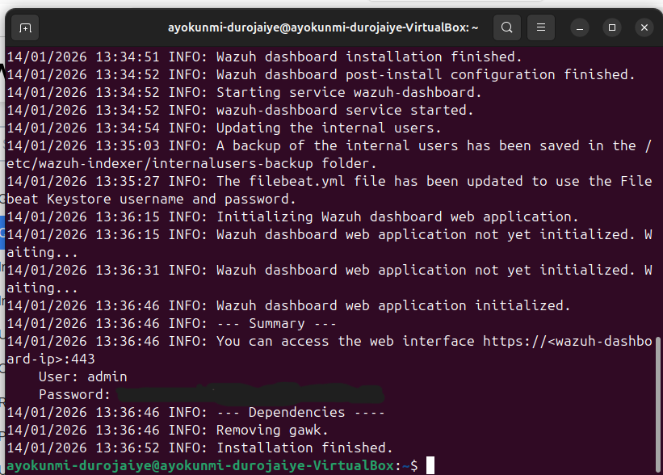
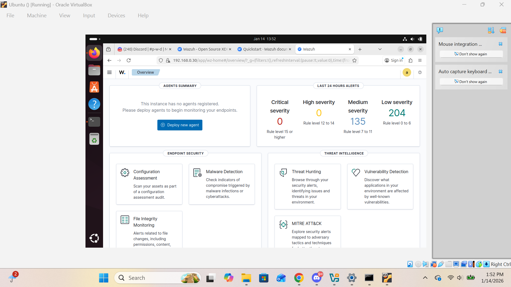
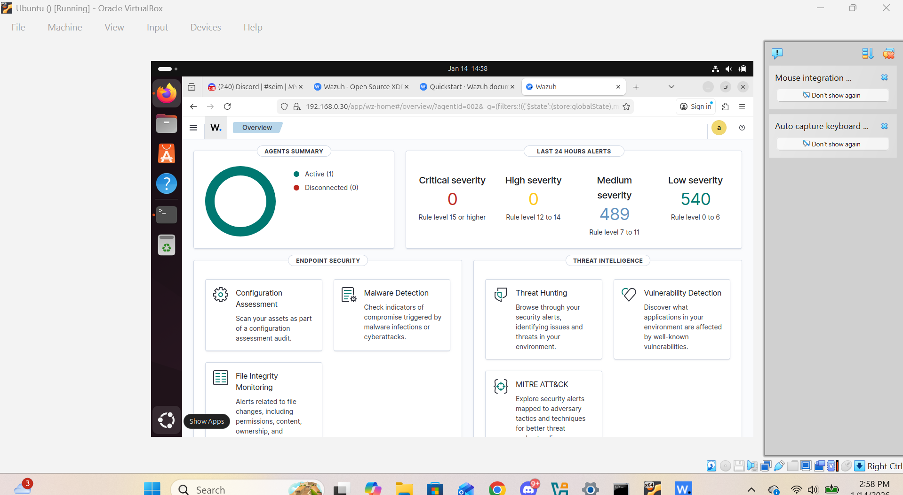
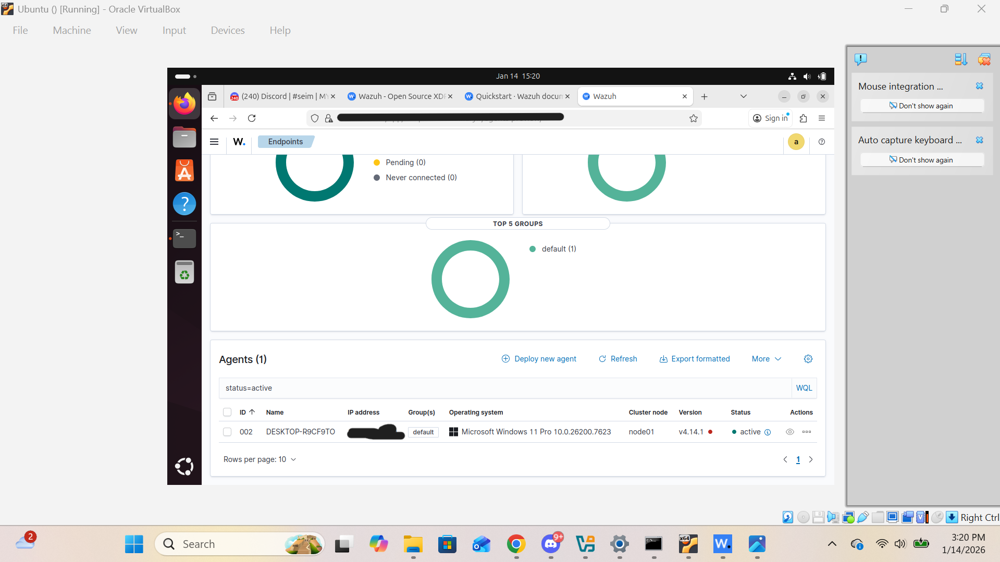
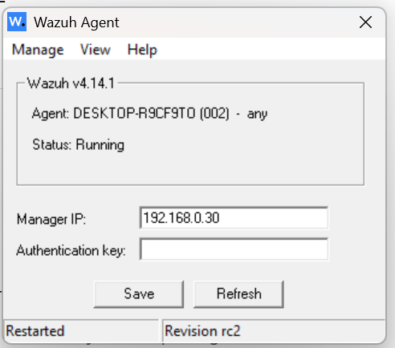

# 🛡️ Wazuh SIEM Home Lab (Ubuntu Manager + Windows 11 Host)

A hands-on **SIEM home lab** built using **Wazuh**, designed to demonstrate real-world skills in endpoint monitoring, agent onboarding, secure communication, alerting, and **File Integrity Monitoring (FIM)**.

This project showcases the full lifecycle of deploying a SIEM solution, connecting a Windows endpoint, troubleshooting agent issues, and validating security detections through controlled testing.

---

## 🎯 Project Objectives

- Deploy a Wazuh SIEM manager on Ubuntu
- Connect a Windows 11 host as a monitored endpoint
- Verify secure agent–manager communication
- Enable and test File Integrity Monitoring (FIM)
- Generate and observe real security events in the dashboard
- Document the entire process clearly for reproducibility

---

## 🧱 Lab Architecture

- **Wazuh Manager & Dashboard**: Ubuntu Linux VM (VirtualBox)
- **Endpoint**: Windows 11 host machine
- **Monitoring Focus**:
  - Agent health & communication
  - Alerts & events
  - File Integrity Monitoring (FIM)

---

## 🛠️ Technologies Used

- Wazuh SIEM (Manager, Dashboard, Agent)
- Ubuntu Linux
- Windows 11
- VirtualBox
- File Integrity Monitoring (syscheck)

---

## 🚀 Step-by-Step Implementation

### 1️⃣ Wazuh Installation Completed (Ubuntu)

The Wazuh manager and dashboard were successfully installed on an Ubuntu VM.



---

### 2️⃣ Dashboard Overview (No Agents Connected)

Initial dashboard state showing no agents registered, confirming a clean baseline.



---

### 3️⃣ Windows Host Successfully Reporting Alerts

After onboarding the Windows host, alerts began appearing in the overview, confirming successful agent communication.



---

### 4️⃣ Active Agent Dashboard View

Detailed agent dashboard showing the Windows endpoint as active and reporting to the manager.



---

### 5️⃣ Wazuh Agent Running on Windows Host

Local Wazuh Agent UI on the Windows host confirming:
- Agent is running
- Manager IP configured correctly
- Successful connection established



---

### 6️⃣ File Integrity Monitoring Configuration

File Integrity Monitoring was enabled by editing `ossec.conf` on the Windows host to monitor a custom test directory:

```xml
<directories realtime="yes">C:\Users\Bubble2\OneDrive\Desktop\Wazuh-test</directories>
